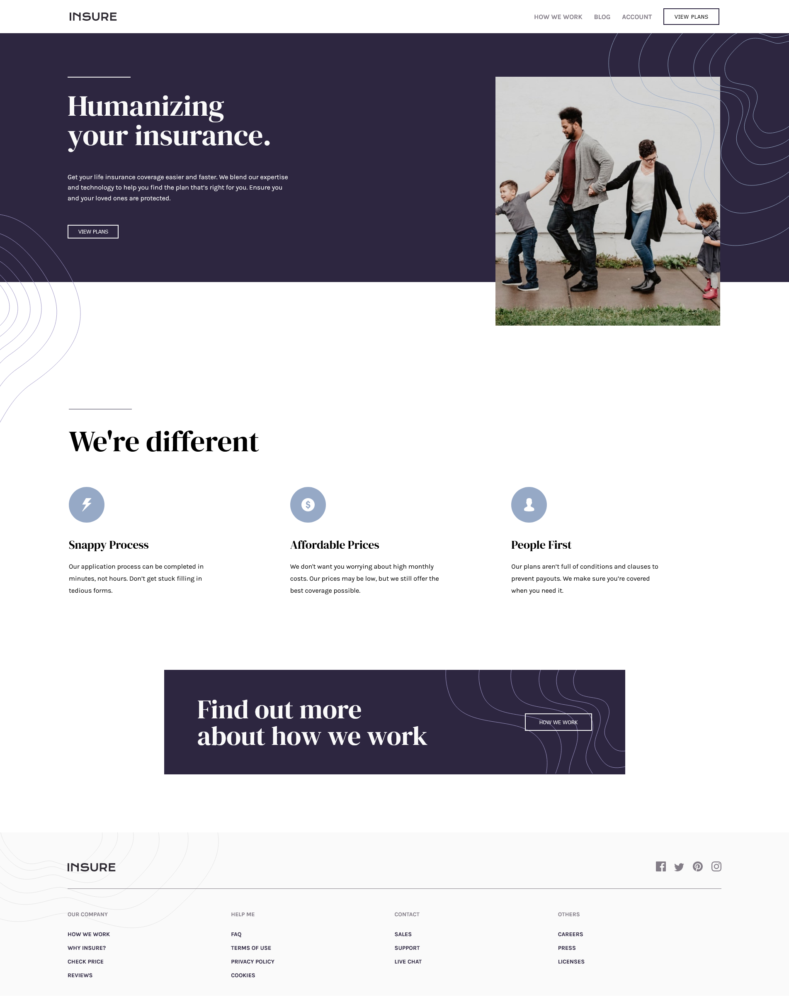

# Frontend Mentor - Insure Landing Page Solution

This is a solution to the [Insure Landing Page on Frontend Mentor](https://www.frontendmentor.io/challenges/insure-landing-page-uTU68JV8).

## Table of contents

- [Overview](#overview)
  - [The challenge](#the-challenge)
  - [Screenshot](#screenshot)
  - [Links](#links)
- [My process](#my-process)
  - [Built with](#built-with)
- [Author](#author)
- [Acknowledgments](#acknowledgments)

## Overview

Your challenge is to build out this landing page and get it looking as close to the design as possible.

You can use any tools you like to help you complete the challenge. So if you've got something you'd like to practice, feel free to give it a go.

The only JavaScript required is for the mobile navigation toggle. However, you could also try doing this without JS.

### The challenge

Users should be able to:

- View the optimal layout for the component depending on their device's screen size
- See hover states for all interactive elements on the page

### Screenshot

### Links

- Solution URL: [https://github.com/JECagurangan/Insure-Landing-Page](https://github.com/JECagurangan/Insure-Landing-Page)
- Live Site URL: [https://je-insure-landing-page.netlify.app/](https://je-insure-landing-page.netlify.app)

## My process

### Built with

- Semantic HTML5 markup
- CSS custom properties
- Flexbox
- CSS Grid
- Mobile-first workflow
- SCSS

## Author

- Website - [Add your name here](https://www.your-site.com)
- Frontend Mentor - [@JECagurangan](https://www.frontendmentor.io/profile/JECagurangan)
- Facebook - [@Jeyihh](https://www.facebook.com/Jeyihh/)
